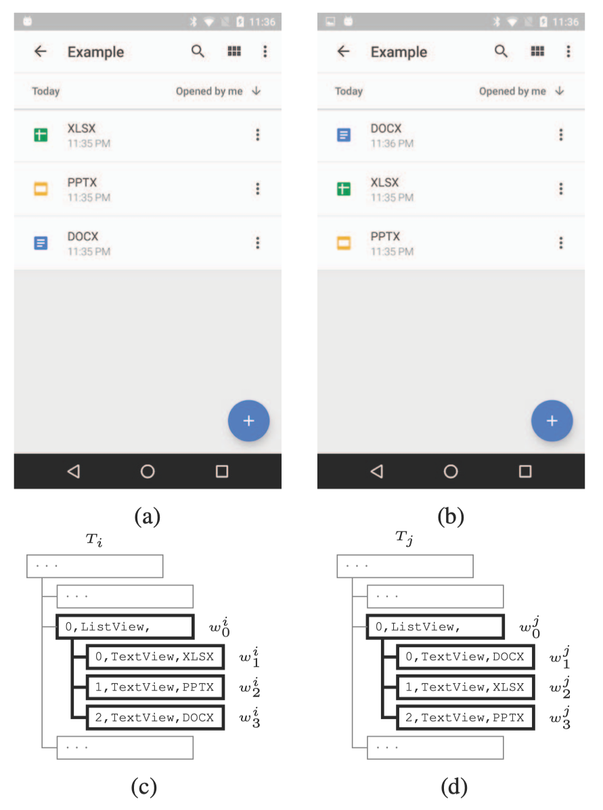

# Practical GUI Testing of Android Applications via Model Abstraction and Refinement (ICSE 2019)

本篇文章介绍了一种基于模型的全自动安卓应用的测试方法，该方法可以利用测试过程中的运行时间，动态地去优化模型，比其他测试方法更高效、更准确，作者利用这个方法实现了一个测试工具，叫做“APE”，该工具在测试覆盖和特殊故障检测方面都表现出了最好的安卓GUI测试性能。

## 1 引言

目前移动应用的测试需要很大的人力成本，测试人员需要编写测试代码，模拟各种界面上行为的发生，执行不同的功能。这种方式费时，而且很容易出错，当界面改变时，测试人员还要对测试的脚本进行修改。

为了解决上面的问题，好多关于自动化的GUI测试的技术开始出现。比如，Monkey是谷歌开发的一款用于GUI模糊测试的工具，可以随机生成一些操作事件来对软件进行测试，但是这种方法也有一些缺点，这种方法不能保证覆盖所有的GUI，而且不能包含用户自定义的一些行为（输入密码、禁止登出等），自动生成的事件往往是低级而且特别长的，会使重构、调试变得更加复杂。

还有一种安卓GUI测试的方法是基于模型的方法，采用的模型往往是一个有限的状态机，每个状态下都有一组模型动作，状态间的转移用模型动作来标识。在实际测试中，测试工具往往将GUI的动作抽象成模型动作，将GUI的视图抽象成模型状态，这样就将GUI的测试转化成为了一种测试模型。

对于GUI测试，模型有以下的优点，
1. 模型可以用于引导应用的开发。测试工具可以使用特殊的引导去遍历模型，系统的生成动作序列，然后通过重演动作序列来对app进行测试。
2. 基于模型的测试工具生成的输入序列更高级。
3. 模型可以进行抽象化，可以减少GUI动作的冗余。通过抽象，好多类似的GUI动作可以归为一个模型动作，测试只针对一个模型动作进行测试即可。模型动作的映射可以说的模型抽象最关键的一个步骤，如果映射的过于细致，那么会产生大量的动作，导致“状态爆炸”，反之，如果映射的过于粗糙，那么不同的GUI动作可能会被归为一个模型动作，导致GUI动作不能被重演。

本文通过有效动态模型抽象，提出了一种基于模型的全自动GUI测试方法-APE。APE首先赋予模型一个默认的抽象规则，用来初始化模型，这种抽象可能是没有用的，但随着测试的进行，APE可以逐渐优化模型，寻找更合适的抽象规则，有效的权衡模型的大小和模型的精度。APE的动态抽象用一个决策树来表示，通过测试过程中的反馈进行微调。

文章将APE和已有的测试工具进行比较，包括Monkey、SAPIENZ、STOAT这三个测试工具，在15个Google Play商店中的大型广泛使用的app上进行测试，APE在活动覆盖率、方法覆盖率、指令覆盖率以及特殊故障检测上，都实现了最好的测试效果。文中还将38个故障上报给开发人员，将故障产生的详细的步骤交给他们复现故障，其中13个故障已经被解决，5个故障已经被证实，并待解决。

总结来说，这篇文章的贡献如下：
1. 提出了一个创新的、全自动的、基于模型驱动的安卓GUI测试工具-APE，与其他测试工具最大的不同就是在于，APE可以动态的进化模型，丢弃掉无用的细节的同时还能充分反映运行时的状态。
2. APE的实现使用了决策树模型去表示模型抽象，让APE在测试过程中可以动态的调整模型，权衡模型大小和模型精度。
3. 通过对比实现，APE可以提升测试过程中代码覆盖率，并且发现更多潜在的bug。
4. 开源了APE的代码。

## 2 相关背景

这一部分主要是介绍基于模型的安卓GUI测试的相关背景

### 2.1 安卓应用的图形界面

安卓app中，一个`活动（activity）`是由许多`部件（widget）`组成的，这些部件组成的结构是树形结构，我们称之为GUI树。一个`部件可以是一个按钮、一个输入框或者是一个layout构成的容器，他可以产生被点击或者被滑动的动作。

部件有四类属性，分别来来描述它的
- 类型
如Class
- 外观
如Text
- 功能
如Clickable
- 同级widget的指定顺序
如index

每个属性都是个键值对，我们用i,c,t分别表示index,class,text属性，那么i=0就表示这个部件的index值为1。

一个GUI树是一个**有根有序**的树，每一个节点$w$代表一个部件，每个部件包含一些属性（$attributes(w)$）。现在的安卓SDK工具可以支持获取一个活动的GUI树，下图中的(c)(d)分别对应(a)(b)的GUI树。由于我们只关心图中加粗的部分，树$T_{i}$和树$T_{j}$的根分别位于部件$w^{i}_{0}$和$w^{j}_{0}$。

</img>

图 2-1 GUI树图解

### 2.2 属性路径

