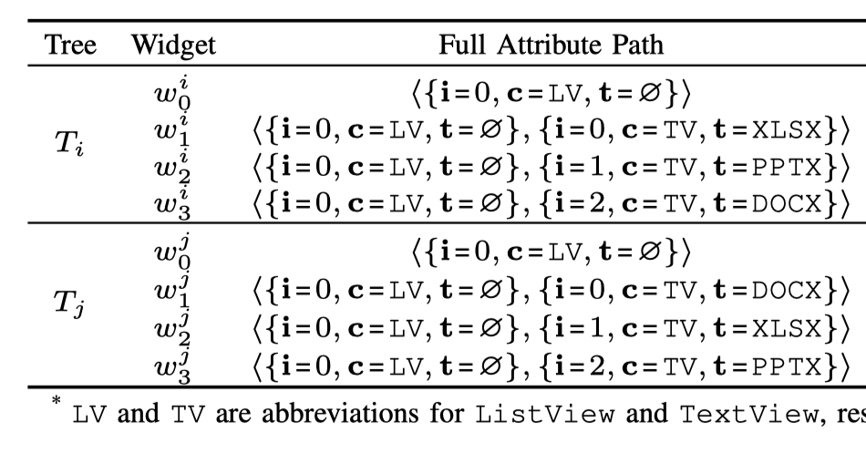
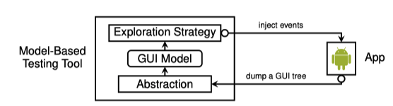
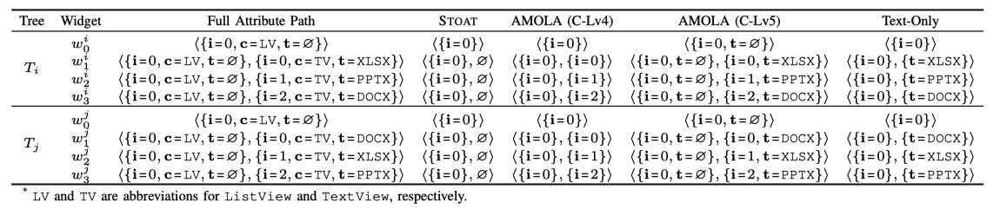
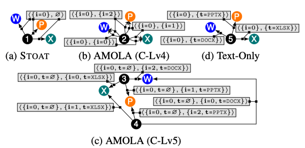
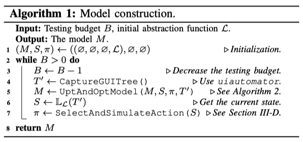
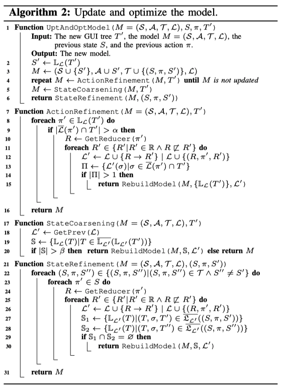
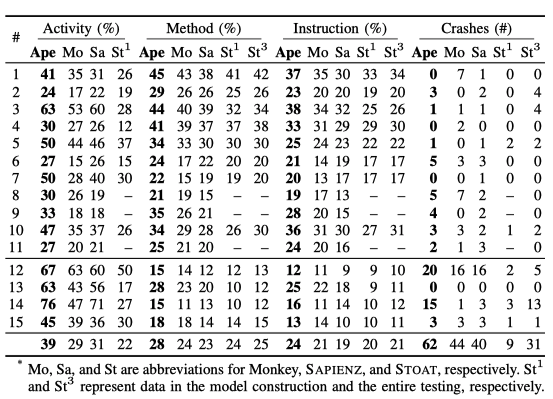
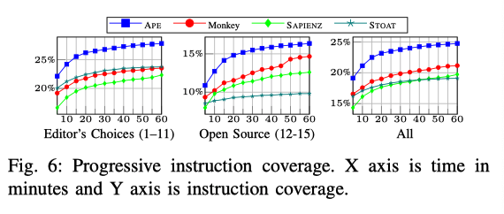
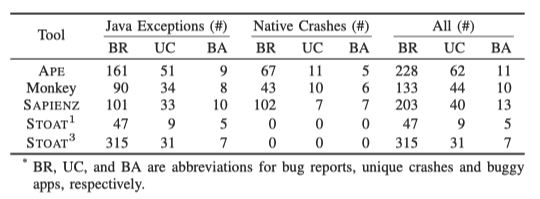
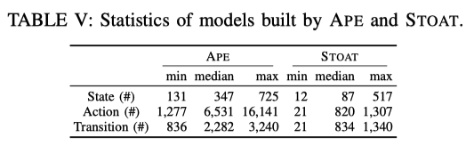

# Practical GUI Testing of Android Applications via Model Abstraction and Refinement (ICSE 2019)

[TOC]

本篇文章介绍了一种基于模型的全自动安卓应用的测试方法，该方法可以利用测试过程中的运行时间，动态地去优化模型，比其他测试方法更高效、更准确，作者利用这个方法实现了一个测试工具，叫做“APE”，该工具在测试覆盖和特殊故障检测方面都表现出了最好的安卓GUI测试性能。

## 1 引言

目前移动应用的测试需要很大的人力成本，测试人员需要编写测试代码，模拟各种界面上行为的发生，执行不同的功能。这种方式费时，而且很容易出错，当界面改变时，测试人员还要对测试的脚本进行修改。

为了解决上面的问题，好多关于自动化的GUI测试的技术开始出现。比如，Monkey是谷歌开发的一款用于GUI模糊测试的工具，可以随机生成一些操作事件来对软件进行测试，但是这种方法也有一些缺点，这种方法不能保证覆盖所有的GUI，而且不能包含用户自定义的一些行为（输入密码、禁止登出等），自动生成的事件往往是低级而且特别长的，会使重构、调试变得更加复杂。

还有一种安卓GUI测试的方法是基于模型的方法，采用的模型往往是一个有限的状态机，每个状态下都有一组模型动作，状态间的转移用模型动作来标识。在实际测试中，测试工具往往将GUI的动作抽象成模型动作，将GUI的视图抽象成模型状态，这样就将GUI的测试转化成为了一种测试模型。

对于GUI测试，模型有以下的优点，
1. 模型可以用于引导应用的开发。测试工具可以使用特殊的引导去遍历模型，系统的生成动作序列，然后通过重演动作序列来对app进行测试。
2. 基于模型的测试工具生成的输入序列更高级。
3. 模型可以进行抽象化，可以减少GUI动作的冗余。通过抽象，好多类似的GUI动作可以归为一个模型动作，测试只针对一个模型动作进行测试即可。模型动作的映射可以说的模型抽象最关键的一个步骤，如果映射的过于细致，那么会产生大量的动作，导致“状态爆炸”，反之，如果映射的过于粗糙，那么不同的GUI动作可能会被归为一个模型动作，导致GUI动作不能被重演。

本文通过有效动态模型抽象，提出了一种基于模型的全自动GUI测试方法-APE。APE首先赋予模型一个默认的抽象规则，用来初始化模型，这种抽象可能是没有用的，但随着测试的进行，APE可以逐渐优化模型，寻找更合适的抽象规则，有效的权衡模型的大小和模型的精度。APE的动态抽象用一个决策树来表示，通过测试过程中的反馈进行微调。

文章将APE和已有的测试工具进行比较，包括Monkey、SAPIENZ、STOAT这三个测试工具，在15个Google Play商店中的大型广泛使用的app上进行测试，APE在活动覆盖率、方法覆盖率、指令覆盖率以及特殊故障检测上，都实现了最好的测试效果。文中还将38个故障上报给开发人员，将故障产生的详细的步骤交给他们复现故障，其中13个故障已经被解决，5个故障已经被证实，并待解决。

总结来说，这篇文章的贡献如下：
1. 提出了一个创新的、全自动的、基于模型驱动的安卓GUI测试工具-APE，与其他测试工具最大的不同就是在于，APE可以动态的进化模型，丢弃掉无用的细节的同时还能充分反映运行时的状态。
2. APE的实现使用了决策树模型去表示模型抽象，让APE在测试过程中可以动态的调整模型，权衡模型大小和模型精度。
3. 通过对比实现，APE可以提升测试过程中代码覆盖率，并且发现更多潜在的bug。
4. 开源了APE的代码。

## 2 相关背景

这一部分主要是介绍基于模型的安卓GUI测试的相关背景

### 2.1 安卓应用的图形界面

安卓app中，一个`活动（activity）`是由许多`部件（widget）`组成的，这些部件组成的结构是树形结构，我们称之为GUI树。一个`部件可以是一个按钮、一个输入框或者是一个layout构成的容器，他可以产生被点击或者被滑动的动作。

部件有四类属性，分别来来描述它的
- 类型
如Class
- 外观
如Text
- 功能
如Clickable
- 同级widget的指定顺序
如index

每个属性都是个键值对，我们用i,c,t分别表示index,class,text属性，那么i=0就表示这个部件的index值为1。

一个GUI树是一个**有根有序**的树，每一个节点$w$代表一个部件，每个部件包含一些属性（$attributes(w)$）。现在的安卓SDK工具可以支持获取一个活动的GUI树，下图中的(c)(d)分别对应(a)(b)的GUI树。由于我们只关心图中加粗的部分，树$T_{i}$和树$T_{j}$的根分别位于部件$w^i_0$ 和 $w^j_0$。

</img>

图 2-1 GUI树图解

### 2.2 属性路径

一个测试工具需要识别app中的部件，积累测试过程中需要的知识。我们并不能用一个对象的内存地址来代表一个部件，因为一个GUI可能会被创建和销毁很多次。在一个GUI树中，给定部件$w_n$，节点路径$w=<w_1,w_2,...,w_n>$是从$w_1$到$w_n$的一个遍历路径，和文件系统中路径的概念类似，如果$w_1$是GUI树的根节点，则$w$是一个`绝对路径`，如果不是GUI树的根节点，则$w$是一个`相对路径`。绝对路径可以唯一标识树中的一个部件，例如，$w_1^i$在图2-1(c)中的唯一路径就是$<w_0^i,w_1^i>$

**定义1：属性路径**
给定一个部件$w_n$和它的节点路径$w=<w_1, w_2, ..., w_n>$，则$w$的**属性路径**为$\pi=<a_1, a_2, ..., a_n>$，其中$a_i$是部件$w_i$的属性子集。

**定义2：全属性路径**
如果一个属性路径满足：  
1. 对应的节点路径$w=<w_1, w_2, ..., w_n>$是绝对路径
2. $a_i$是部件$w_i$的所有属性

那么我们称这个属性路径是**全属性路径**，记做$\sigma$。

这样，一个部件就可以用一个全属性路径唯一标识，全属性路径中的部件顺序反映了部件的层次结构，每个部件中的索引属性决定了部件和兄弟节点的唯一位置，因此，一个GUI树等同于所有全属性路径的集合，如下表所示。

表 2-1 全属性路径

</img>

**定义3：属性路径缩减**
属性路径缩减函数$R$以属性路径$\pi=<a_1, a_2, ..., a_n>$作为输入，返回一个新的属性路径$\pi'=<b_m, ..., b_n>$。
其中，$1\leq m \leq n$且对于任意$m\leq i \leq n$都有$b_i \in a_i$。

也就是说，$\pi'$是$\pi$的后缀，而且$\pi'$中的每个元素都是$\pi$对应元素的子集。

*(论文中为了方便说明问题，假定每个部件仅支持一个动作，部件和动作的关系是双射的，而他们真正的系统实现是支持多个动作的)*

### 2.3 基于模型的安卓GUI测试

图2-2中展示了典型的基于模型的GUI测试流程，测试工具与应用软件迭代交互。刚开始时，测试工具的模型是一个空的状态机，随着每次迭代，测试工具做了如下几件事情：
1. 获取了应用软件当前的GUI树
2. 识别已经存在的状态，并创建新的状态
3. 选择一个模型动作，确定和app交互的GUI动作

</img>

图 2-2 基于模型的GUI测试流程图

基于模型的GUI测试工具的目的在于发现更多的部件，并在已经发现的部件中测试他们的交互过程，现在的安卓应用界面中部件数量很庞大，需要将一些相同的模型动作进行抽象，以减少搜索的空间。然而，判断两个部件是否等价是不容易的。全属性路径中通常包含不相关的信息，很难发现两个语义上等价的部件。比如图2-1中的$w_i^1$和$w_j^2$都是一个表格类型的TextView，然而在表2-1中对应的全属性路径是不同的，因此，单纯靠全属性路径判断等价部件会使模型规模越来越大。

**状态抽象**

将等价的GUI树映射到同一个模型状态的过程以及将等价的GUI动作映射到同一个模型动作的过程，都被成为**状态抽象**。

满足如下两个条件的GUI动作被认为是等价的：
1. 动作类型相同
2. 全属性路径可以通过一定的缩减规则去除一些不相关属性，缩减为相同的属性路径$\pi$

对应的模型动作就记作$\pi$，如果考虑动作类型$\tau$，则模型动作可以记作$<\pi,\tau>$。

同样的，满足以下条件的GUI树被认为是等价的：
- 包含的所有的GUI动作可以减为相同的属性路径的集合。

对应的模型状态可以用所有模型动作的集合表示，也就是属性路径$\pi$的集合。

然而，自动化测试工具的缩减规则是通过测试逐渐自己形成的，不是人为定义的。测试工具对于不同部件会执行不同的缩减规则，以达到合适的抽象粒度。

例如，STOAT会假定ListView的子部件都是等价的，它会移除ListView子部件的所有属性，其他部件只去掉type和text属性。针对图2-1的例子，STOAT会将全属性路径缩减为$<\{i=0\},\emptyset>$。因此，图2-1中的(a)和(b)属于同一个状态， 因为他们的模型动作相同。

再比如，AMOLA有五种静态抽象的方法，其中的C-Lv5准则同时考虑了index和text属性，因此，图2-1中的(a)和(b)属于两种不同的状态。

表 2-2 不同方法的缩减属性路径

</img>

在一个状态机图中，圆形表示模型的某种状态，圆形之间的线表示状态之间转移的模型动作，如下图所示。

</img>

图 2-3 模型的状态机图（部分）

粗粒度的抽象一定程度上可以避免“状态爆炸”，而细粒度的抽象可以准确描述运行状态，因此，评价模型抽象的标准就是这个抽象方法是否能均衡模型大小和模型精度，实现最佳的GUI测试效果。在上图中，STOAT是粗粒度的抽象，即使是在相同的GUI中，执行的同一个动作会进入不同的页面，AMOLA(C-Lv4)却可以在同一个GUI中，区分出word,excel和powerpoint，而不同GUI也会出现问题。最合适的其实是(c)，对于ListView的子部件抽象的时候只保留了text属性，然而，目前已有的工具无一可以做到这种抽象，而本文提出的动态抽象的方法做到了。

## 3 本文的方法介绍

### 3.1 模型

**定义4：模型**
在APE中，模型$M$用一个元组$(\mathcal{S},\mathcal{A},\mathcal{T},\mathcal{L})$表示，其中，
- $\mathcal{S}$代表状态的集合, $\mathcal{S}$中的元素则是一个状态，也就是一个属性路径的集合。
- $\mathcal{A}$代表模型动作的集合，每个模型动作$\pi\in\mathcal{A}$是一个属性路径。$\mathcal{A}$和$\mathcal{S}$的关系是$\mathcal{A}=\cup_{S\in\mathcal{S}}S$。
- $\mathcal{T}$代表状态转移的集合（$\mathcal{S}\times\mathcal{A}\times\mathcal{S}$），每个转移$(S,\pi,S')$都有一个源状态$S$，和一个目标状态$S'$，转移的标签就是一个模型动作$\pi$。
- $\mathcal{L}$是抽象函数，将全属性路径$\sigma$缩减为一个属性路径$\pi$，即$\mathcal{L}(\sigma)=\pi$.

APE在每次迭代的过程中，记录了每次的GUI转移，每次转移是一个$(T,\sigma,T')$元组。为了更方便的表示，我们可以由$\mathcal{L}$派生两个变体函数，$\mathbb{L}_\mathcal{L}$和$\mathfrak{L}_\mathcal{L}$，分别用来处理GUI树和GUI转移。

给定一个GUI树$T$，$\mathbb{L}_\mathcal{L}$函数可以用来寻找其对应的模型状态$S$，

$$
S=\mathbb{L}_\mathcal{L}(T)=\{\pi|\pi=\mathcal{L}(\sigma)\land\sigma\in T\}
$$

给定一个GUI转移$(T,\sigma,T')$，$\mathfrak{L}_\mathcal{L}$函数可以用来寻找其对应的模型转移$(S,\pi,S')$，

$$
(S,\pi,S')=\mathfrak{L}_\mathcal{L}((T,\sigma,T'))=(\mathbb{L}_\mathcal{L}(T),\mathcal{L}(\sigma),\mathbb{L}_\mathcal{L}(T'))
$$

算法1中描述了基于模型的测试过程，模型$M$起始是空的，每次迭代都存在一个模型状态$S$和一个模型动作$\pi$,UptAndOptModel函数会对模型进行优化，SelectAndSimulateAction函数会决定下一步的模型动作。

</img>

图 2-4 模型构造

### 3.2 动态抽象函数

动态抽象是APE的一个亮点，而动态地去对模型进行抽象是不容易实现的，他应该具有以下几个性质：
- 自适应的
抽象粒度随着测试过程在不断调整，代码也是动态改变的。
- 可生成的
测试过程中会发现新的GUI树和一些属性路径，在模型中生成新的状态和转移。
- 可解释的
用户可以结合一些关键的规则，改善动态抽象。

APE的模型抽象是通过决策树实现的。给定一个全属性路径$\sigma$，决策树可以决定缩减的规则是如何的。决策树是一个有根树，每个节点就是一个缩减器$R$，每条边（分支）用一个属性路径$\pi$标识，$\pi$被称为这个分支的选择器。

给定一个全属性路径，如果某个分支可以将这个路径缩减为属性路径$\pi$，那么称这个分支选择了这个全属性路径；给定一个GUI树，如果某个分支可以将树中一个全属性的集合缩减为属性路径$\pi$，那么称这个分支选择了这个全属性集合。

给定一个全属性路径$\sigma$，从决策树的根节点开始，看这个节点是否存在某些分支可以选择这个全属性路径，如果存在，则转移到这个分支对应的子节点$n$，然后递归的去查找。如果找不到任何一个选择器了，那么缩减器n就作为消减$\sigma$的输出，n被称为输出节点。

决策树需要为$\sigma$选择一个且仅有一个缩减器，为了保证这个性质，我们需要设计一个方法，使任何全属性路径最多只能被一个分支选择。

一个缩减器是一些原始缩减器的集合。

**定义5：本地缩减器**
用$A$表示属性键的集合。给定一个全属性路径$\sigma=<a_1,a_2,...,a_n>$，本地缩减器$R_A$去掉了$a_1,a_2,...,a_{n-1}$，只保留了$a_n$中$A$集合对应的属性。
$$
R_A(\sigma)=<\{(k,v)|(k,v) \in a_n \land k \in A\}>
$$

**定义6：祖先缩减器**
给定一个全属性路径$\sigma=<a_1,a_2,...,a_n>$，祖先缩减器$R_p(\sigma)=\mathcal{L}(<a_1,a_2,...,a_{}n-1>)$，祖先缩减器重用了属性路径$<a_1,a_2,...,a_{n-1}>$的输出，不保留$a_n$。
$$
R_p(\sigma)=\mathcal{L}(<a_1,a_2,...,a_{n-1}>)\oplus R_\emptyset(\sigma)
$$

$\oplus$代表序列的连接。

**定义7：缩减器聚合**
给定一个全属性路径$\sigma=<a_1,a_2,...,a_n>$，两个缩减器$R$和$R'$，假设$R(\sigma)=<b_m,b_{m+1},...,b_n>$,$R'(\sigma)=<c_k,c_{k+1},...,c_n>$，且$m \leq k$。缩减器聚合$R \bowtie R'(\sigma)$如下表示：
$$
R \bowtie R'(\sigma)=<b_m, b_{m+1},...,b_k\cup c_k,b_{k+1}\cup c_{k+1}, ..., b_n\cup c_n>
$$

这里还定义了一种偏序关系，如果$R'$比$R$包含更多的基础缩减器，那么就称$R'$比$R$更细化，即$R' \sqsubset R$

### 3.3 优化抽象函数

APE有一个初始的抽象函数，但会随着测试过程不断的细化或者粗化抽象的粒度，以使模型达到一个最合适的精度。

细化既包括将某个叶子输出节点的缩减器$R$替换为不粗化的缩减器$R'$($R'\sqsubseteq R$)，也包括将一个新的更细化的缩减器$R'(R'\sqsubset R)$连接到当前的决策树中。粗化就是将当前被细化的抽象函数$\mathcal{L}$恢复为之前的抽象函数$\mathcal{L}'$，这个操作称为**还原**。因此，我们初始化的抽象函数是抽象的最低标准，要足够的粗化。

最极端的粗化就是把所有的GUI树映射在一个模型状态上，所有GUI动作映射在一个模型动作上，然而这样做是没有意义的，这样的模型不存在任何的状态转移。为了避免这个情况，文中定义了两个阈值($\alpha$和$\beta$)，首先，对模型进行细化，细化后的模型动作对应抽象的GUI动作不能超过$\alpha$个，然后，进一步细化，消除所有**不确定转移**，所谓不确定转移，就是同一个源状态通过同一个动作，可能到达不同的目的状态，最后，为了避免细化的太多导致状态爆炸，如果某个抽象函数被细化后，会生成大于等于$\beta$个新状态，那么就将这些抽象进行还原。

综上，模型要满足三个条件：

- 细化后的模型动作对应抽象的GUI动作不能超过$\alpha$个。
- 不存在不确定转移
- 细化后的新增的模型状态不超过$\beta$个

【这里有个例子解释这个优化的过程，STOAT逐渐演变为Text-Only】

为了更方便地解释优化模型的算法过程，这里还要定义三个变量：

- $\overline{\mathcal{L}} (\pi)$：抽象成为模型动作$\pi$的GUI动作的集合。
- $\overline{\mathbb{L}}(S)$：抽象成为模型状态$S$的GUI树的集合。
- $\overline{\mathfrak{L}}((S,\pi,S'))$：抽象成为模型转移$(S,\pi,S')$的GUI转移的集合。

图2-5展示了优化模型的算法过程，在`UptAndOptModel`函数中，首先会判断添加的模型状态$S'$和转移$(S,\pi,S')$是否违背前面所说的三个条件，如果违背说明需要继续对模型进行优化，优化分为三个步骤，分别对应函数`ActionRefinement`、`StateRefinement`、`StateCoarsening`。

`ActionRefinement`

该函数用来细化模型动作，对所有抽象了大于$\alpha$个GUI动作的模型动作$\pi'$进行细化，`GetReducer`函数获取生成$\pi'$的缩减器$R$，通过将缩减器替换为更细粒度的缩减器$R'$或者新增一个分支去连接$R'$，来达到细化的目的。

`StateCoarsening`

该函数用来将细化程度过高的模型状态`StateCoarsening`进行还原

`StateRefinement`

该函数用来细化模型状态，消除所有不确定的状态转移。如果两种细化都可以消除不确定转移，则选择模型状态最少的，其次是模型动作最少的。

</img>

图 2-5 更新优化模型的算法

有的时候细化和粗化会相互冲突，那么这个时候会直接选择粗化，避免模型状态爆炸。

对于路径的搜索，文中采取了随机+贪心的策略：

- 搜索连通子图，在连通子图中进行遍历，搜索所有的模型动作
- 以贪心的方式访问每一个新加入的模型动作
- 随机访问下一个模型动作，对于没有访问的模型动作或者抽象了更多的GUI动作的模型动作优先考虑。

## 3 实现

APE的开发是建立在Monkey的基础上，对模拟器和真机分别进行了测试。在Android 6 和 7版本的设备上对APE的兼容性进行测试，GUI树可以通过安卓的API获取。最开始的决策树使用$R_c$（class）缩减器，且只有一个决策树，如果状态需要细化，可以建立一个新的决策树备份，必要的时候可以用到。

## 4 实验结果

### 4.1 代码覆盖率

在15个APP上，APE分别在活动覆盖率、方法覆盖率以及指令覆盖率上提升了26–78%，17–22%，14–26%。

</img>

图 2-6 覆盖率对比

而且APE的覆盖率增长的速度也很快，说明GUI测试的速度很快，如下图所示。

</img>

图 2-7 指令覆盖速度对比

### 4.2 故障检测

APE可以检测最多的独特故障。

</img>

图 2-8 GUI测试故障检测

### 4.3 比较分析

**基于模型&不用模型**

APE基于模型生成的测试事件比较少，但活动覆盖率是最高的，说明其生成的事件更加高效。

**动态模型&静态模型**

动态模型相比于静态模型更加细化，如下图所示。

</img>

图 2-9 APE和STOAT模型比较

## 5 相关工作

移动应用软件质量的保障是有挑战性的，而安卓应用出现的问题是多种多样的，目前已有的一些工作针对安卓不同的方面进行测试，其中包括上下文、并发异步特性、恶劣条件下的性能等等。安卓测试工具主要有两种，一种是针对后台服务的测试，而绝大部分的测试属于另一种，即针对GUI界面进行的测试，很少有能够做到两种测试合一的工具。

好多工具将黑盒测试改进为适用于GUI测试的方法，也有一些基于模型、基于符号执行、基于搜索的测试方法可以更好的去引导测试，然而在大型应用上面临着规模问题。SAPIENZ就是一个创新的基于搜索的GUI测试方法，APE也是利用了SAPIENZ的搜索策略来提升测试性能。

也有好多工作在针对规模问题进行优化，比如在测试过程中改变应用的架构。对于基于模型的方法，我们也可以利用粗粒度模型或概率模型，但是细化的模型更加准确。APE创新的去自适应模型的粒度，可以随着测试过程不断优化模型。

## 6 进一步工作

